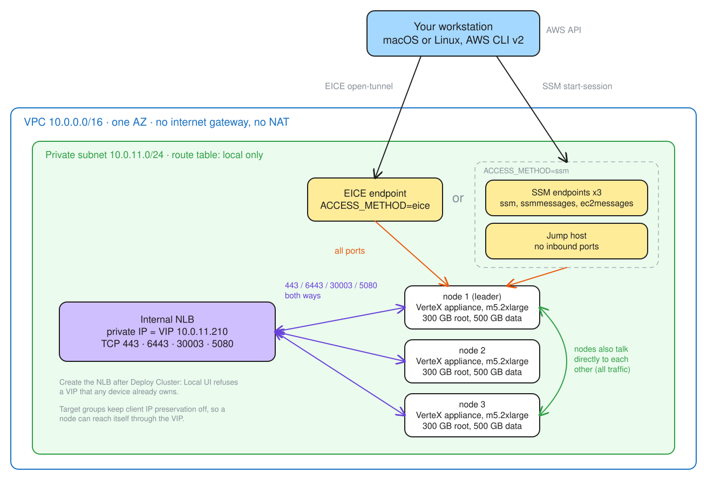

# VerteX 4.10.14 appliance on AWS GovCloud: private subnets only

Install guide for a deployment with **no public subnets**: no internet gateway, no NAT
gateway, no public IPs, and no route to the internet anywhere in the VPC. There is no
bastion; you reach the nodes from your workstation through an AWS service, either an
**EC2 Instance Connect Endpoint (EICE)** or **Session Manager (SSM)**.

Tested on 2026-10-09 in us-gov-west-1 with `vertex-enterprise-appliance-4.10.14`
(`ami-0801ea0ff68e48cc6`), 3 nodes, access method EICE: verified end to end through the
VIP, with the Kubernetes API, registry and Palette (443) healthy on all three nodes about 29
minutes after Deploy Cluster. The SSM path is built by the same scripts but not yet tested
end to end.

The scripts in this directory automate the AWS side; each step names the script that does it.

---

## Quick steps

- **Pick a region and one availability zone** that offers m5.2xlarge.
- **Build the network:** a VPC (DNS support and DNS hostnames on) with **one private subnet**
  and a route table with **no default route**. No internet gateway, no NAT.
- **Create security groups** (empty first, then rules): access, app, NLB; for SSM also an
  endpoints group. The app group allows **all traffic to and from itself**.
- **Build the access path:**
  - **EICE:** one EC2 Instance Connect Endpoint in the private subnet, client IP not preserved.
  - **SSM:** interface endpoints for ssm, ssmmessages and ec2messages (private DNS on), an IAM
    role with AmazonSSMManagedInstanceCore, and a small Amazon Linux jump host with no inbound
    ports.
- **Choose the VIP:** a free IP in the private subnet, for example 10.0.11.210.
  **Do not create the NLB yet.**
- **Launch three nodes** from the AMI: m5.2xlarge, private subnet, app group, **300 GB gp3
  root volume**, one 500 GB gp3 data volume, metadata "V1 and V2 (token optional)", user data
  with your Local UI user.
- **Wait 25-30 minutes.** Each node resets itself out of recovery mode (about 4-6 minutes), then
  Local UI starts.
- **Open Local UI from your workstation:** forward each node's port 5080 (`./connect.sh
  localui`) and open node 1 at `https://localhost:5080`, node 2 at `https://127.0.0.1:5081`,
  node 3 at `https://[::1]:5082`.
- **Link the nodes:** node 1 generates a token; nodes 2 and 3 link to it. Wait for Ready and
  Synced/Healthy.
- **Create the cluster:** embedded config, OCI Pack Registry password, your **Ubuntu Pro
  token** (Profile Config; enter it now, not after deployment), **VIP = the IP you chose**,
  all three nodes in control-plane-pool, **Deploy Cluster**.
- **Within a minute, create the internal NLB on the VIP** with TCP listeners on 443, 6443,
  30003 and 5080, target groups with **client IP preservation off** (`./deploy.sh`).
- **Watch it come up:** 6443, then 30003, then 443 turn healthy on all nodes. If `mongo-0`
  sticks in `Init` with "mongo.key is empty", set the key (Troubleshooting).
- **Validate.**

---

## Architecture



The NLB's private IP is the cluster VIP. The access path reaches the nodes and the NLB; the
nodes reach each other and the NLB, and nothing outside the VPC.

---

## Before you start

- **A workstation running macOS or Linux, on x86_64 or arm64**, with bash 3.2 or later. Each
  script checks for the tools it needs before doing anything and, if one is missing, prints
  the install command for your OS and CPU (Homebrew on macOS; the AWS installers, `apt` or
  `dnf` on Linux):

  | Tool | Needed by |
  | --- | --- |
  | AWS CLI v2 (2.12 or later for EICE's `open-tunnel`) | Every script |
  | OpenSSH client (`ssh`) | EICE access: `connect.sh` |
  | Session Manager plugin | `ACCESS_METHOD=ssm`: `connect.sh` |
  | `kubectl` | `./connect.sh kubeconfig`, and kubectl access to the cluster |

- **AWS credentials** allowed to manage EC2, Elastic Load Balancing v2, VPC and, for SSM, IAM
  roles and instance profiles. The scripts confirm them with `sts get-caller-identity` first.
- **The AMI** shared into the region (us-gov-west-1: `ami-0801ea0ff68e48cc6`).
- **An EC2 key pair** and its private key on your workstation. The AMI installs this key for
  the `kairos` user, so SSH works with it; `kairos` has no usable password.
- **A Local UI user and password** for the user data, an **OCI Pack Registry password** for
  cluster creation, and your **Ubuntu Pro token** for the same step.

| Parameter | Value used | Notes |
| --- | --- | --- |
| Region / zone | us-gov-west-1 / us-gov-west-1a | One zone: the VIP field takes one IPv4 address |
| VPC CIDR | 10.0.0.0/16 | |
| Private subnet | 10.0.11.0/24 | Nodes, NLB and access endpoints |
| Nodes | 3 x m5.2xlarge | 1 also works |
| Root volume | 300 GB gp3 | **At least 300 GB** (Step 4) |
| Data volume | 1 x 500 GB gp3 | The AMI builds its storage pool (LINSTOR/DRBD) on it |
| VIP | 10.0.11.210 | Free IP in the private subnet; becomes the NLB's IP |
| Access | EICE or SSM | `ACCESS_METHOD` in `config.env` |

---

## Step 1 - Network

| Resource | Settings |
| --- | --- |
| VPC | 10.0.0.0/16; DNS support and DNS hostnames on (SSM endpoints need private DNS) |
| Private subnet | 10.0.11.0/24 in the chosen zone; no public IPs |
| Route table | **Local route only**; associated with the private subnet |

There is no internet gateway and no public subnet. Nothing in the VPC can reach the internet,
and nothing on the internet can reach it.

Scripted: `./create-vpc.sh` (refuses an internet gateway or any default route).

---

## Step 2 - Security groups

Create the groups empty, remove each one's default allow-all outbound rule, then add:

| Group | Inbound | Outbound |
| --- | --- | --- |
| access | (none) | All traffic to app and NLB; **SSM only:** TCP 443 to endpoints |
| endpoints (SSM only) | TCP 443 from access | (none) |
| app | All traffic from access; 443, 6443, 30003, 5080 from NLB; **all traffic from app** | 443, 6443, 30003, 5080 to NLB; **all traffic to app** |
| NLB | All traffic from access; 443, 6443, 30003, 5080 from app | 443, 6443, 30003, 5080 to app |

- **access** is the EICE endpoint's group, or the SSM jump host's group.
- The app group's **self-referencing rules** are required for more than one node: linking a
  node to the leader goes straight to `<leader-ip>:5080`, and the cluster needs etcd (2379,
  2380), kubelet (10250), the CNI and DRBD replication between nodes.
- AWS DNS, the instance metadata service and Amazon Time Sync are not filtered by security
  groups.

Scripted: part of `./deploy.sh`.

---

## Step 3 - Access path

### Option A: EC2 Instance Connect Endpoint (`ACCESS_METHOD=eice`)

One endpoint in the private subnet, in the access group, **client IP not preserved** (so the
nodes see the endpoint's address, which the app group's "all traffic from access" rule matches):

```
aws ec2 create-instance-connect-endpoint --subnet-id <private-subnet-id> \
  --security-group-ids <access-sg-id> --no-preserve-client-ip
```

It is ready in about 3 minutes (state `create-complete`). No instance, no IAM role, no hourly
charge. It tunnels SSH (port 22) only, so Local UI and the API are reached with `ssh -L`
through a node:

```
ssh -i <key>.pem -o ProxyCommand="aws ec2-instance-connect open-tunnel --instance-id %h" kairos@<node-instance-id>
```

### Option B: Session Manager (`ACCESS_METHOD=ssm`)

| Resource | Settings |
| --- | --- |
| Interface endpoints | `com.amazonaws.<region>.ssm`, `.ssmmessages`, `.ec2messages`; private subnet; endpoints group; private DNS on |
| IAM role + instance profile | Trust `ec2.amazonaws.com`; policy `arn:aws-us-gov:iam::aws:policy/AmazonSSMManagedInstanceCore` |
| Jump host | Amazon Linux 2023 (SSM parameter `/aws/service/ami-amazon-linux-latest/al2023-ami-kernel-default-x86_64`), t3.micro, private subnet, access group, the instance profile, IMDSv2 required |

Wait for the jump host to show `Online` in Session Manager (a few minutes), then forward any
node port to your workstation:

```
aws ssm start-session --target <jump-host-id> --document-name AWS-StartPortForwardingSessionToRemoteHost \
  --parameters '{"host":["<node-ip>"],"portNumber":["5080"],"localPortNumber":["5080"]}'
```

The three endpoints and the jump host are billed hourly while they exist.

Scripted: part of `./deploy.sh`, based on `ACCESS_METHOD`.

---

## Step 4 - Nodes

| Setting | Value |
| --- | --- |
| AMI | The appliance AMI |
| Instance type | m5.2xlarge |
| Network | Private subnet, app group, no public IP |
| Root volume | **300 GB gp3** (at least 300) |
| Data volume | 1 x 500 GB gp3 |
| Instance metadata | "V1 and V2 (token optional)" |
| User data | Below |

**Why at least 300 GB.**

- **Under 40 GB the node never leaves recovery:** the first-boot reset has no room for its
  19,780 MiB `COS_STATE` partition.
- **Too small, and kubelet deletes images the node can't get back.** Kubernetes gets
  whatever the root has left (59.8 GiB on 100 GB). On 100 GB roots the leader passed
  kubelet's 85% cleanup threshold during install and deleted preloaded images (mongo,
  cert-manager and others) that the local registry doesn't serve; pods that later need them
  fail with `ImagePullBackOff`. At 300 GB that space is about 246 GiB, and the install uses
  about a fifth of it.

**User data** (your Local UI user; the AMI's `kairos` password is locked on every boot):

```yaml
#cloud-config
stages:
  initramfs.after:
    - users:
        fusion:
          groups:
            - sudo
            - admin
          passwd: "<strong password>"
          shell: /bin/bash
          lock_passwd: false
          sudo: ALL=(ALL) NOPASSWD:ALL
          ssh_authorized_keys:
            - ssh-rsa AAAA... you@example.com
      name: "create admin user"
```

User data accounts exist from the second boot on (after the reset). Anyone who can read the
instance's user data can read the password; use a strong one.

Scripted: `./deploy.sh --no-nlb` (security groups, access path and nodes; no NLB or target
groups yet).

---

## Step 5 - Wait for Local UI

Observed timing (2026-10-09):

| After launch | What happens |
| --- | --- |
| 0-1 min | First boot, into Kairos recovery mode |
| 1-4 min | The AMI's own reset builds the active system, then reboots |
| 4-25 min | Airgap content is read and unpacked (the wait is mostly EBS: first-read fetches from S3, writes capped at 125 MiB/s on default gp3) |
| ~25-30 min | Local UI answers on 5080 |

Then forward Local UI to your workstation:

```
./connect.sh localui
```

| Node | Address on your workstation |
| --- | --- |
| 1 (leader) | `https://localhost:5080` |
| 2 | `https://127.0.0.1:5081` |
| 3 | `https://[::1]:5082` |

The three host names keep each node's login separate (browsers share cookies across ports on
one host name). If `[::1]` does not load, open `https://localhost:5082` in a private window.

With EICE, the forwards ride one SSH connection to node 1, which reaches nodes 2 and 3 over the
node-to-node rule. With SSM, each forward is its own session through the jump host.

A node whose EC2 status check stays "impaired" with no disk activity after its reset has hung
on its first active boot; reboot it.

---

## Step 6 - Link the nodes

1. Node 1 (`https://localhost:5080`): sign in with your user-data user, **Linked Edge Hosts >
   Generate token**, copy it.
2. Node 2 (`https://127.0.0.1:5081`): sign in, **Linked Edge Hosts > Link this device to
   another**, paste, **Confirm**.
3. Node 3 (`https://[::1]:5082`): the same. Generate a new token if one is rejected.
4. On node 1, wait until all three show **Ready** and **Synced / Healthy**.

---

## Step 7 - Create the cluster, then the NLB

Local UI refuses a VIP that any device already owns ("VIP address is already assigned to a
device on the network"), and an NLB's IP belongs to its network interface. So the NLB must not
exist when you create the cluster.

In Local UI on node 1:

1. **Cluster > Create cluster**; the name cannot be changed later.
2. **Cluster Profile:** Use embedded config.
3. **Profile Config:**
   - **Vertex Addon Profile:** OCI Pack Registry Password.
   - **Ubuntu Pro Token (Optional)**, with the cluster profile options (Pod CIDR, Service
     CIDR, image pull secret): enter your token here, during cluster creation. It is
     optional but recommended for security and compliance; the FIPS kernel is already in
     the image. Adding it after deployment, from the cluster's configuration tab, repaves
     every node.
   - Leave the rest at their defaults.
4. **Cluster Config:** VIP = `10.0.11.210` (the free IP you chose).
5. **Node Config:** control-plane-pool > **Add Item** > all three hosts.
6. Review, **Deploy Cluster**.

Within a minute, create the NLB on that IP:

```
./deploy.sh
```

or by hand: an internal NLB with `--subnet-mappings SubnetId=<private-subnet-id>,PrivateIPv4Address=10.0.11.210`
and the NLB group; one TCP target group per port (443, 6443, 30003, 5080), instance targets, TCP
health checks, `preserve_client_ip.enabled=false`; all three nodes registered; one TCP listener
per port.

Observed on 2026-10-09 (Deploy Cluster at about 13:57 UTC, NLB created within a minute):

| After Deploy Cluster | On the NLB |
| --- | --- |
| ~6 min | Kubernetes API (6443) healthy on node 1 |
| ~9 min | API healthy on all three nodes |
| ~16 min | Registry (30003) healthy on all three nodes |
| ~29 min | Palette (443) healthy on all three nodes |

Follow progress with `./connect.sh ssh 1` and `sudo journalctl -u stylus-agent -f`. Pulls from
`<VIP>:30003` fail with "connection refused" or "not found" until the registry is up and loaded,
then clear. `./status.sh` shows target health.

---

## Step 8 - Validate

- [ ] All four target groups healthy on all three nodes (`./status.sh`).
- [ ] On node 1: `sudo kubectl --kubeconfig /etc/kubernetes/admin.conf get nodes` lists three
      Ready control-plane nodes.
- [ ] `kubectl get pods -A` shows nothing outside Running or Completed, `hubble-system` included.
- [ ] On a node: `curl -sk https://10.0.11.210:6443/healthz` returns `ok` (or 401/403).
- [ ] On a node: `curl -m 5 https://example.com` fails (no egress).
- [ ] The VPC has no internet gateway and no default route (`./create-vpc.sh` checks this).

### kubectl from your workstation

1. `./connect.sh kubeconfig` copies node 1's `/etc/kubernetes/admin.conf` to
   `kubeconfig-<NAME_PREFIX>` and points it at the forward below.
2. `./connect.sh api` in another terminal (forwards the VIP's 6443 to `localhost:6443`).
3. `kubectl --kubeconfig kubeconfig-<NAME_PREFIX> get nodes`.

By hand: in the copied file's cluster entry, change `server:` and **add** `tls-server-name`
(the API certificate lists `kubernetes` and the VIP, not `localhost`):

```yaml
clusters:
- cluster:
    certificate-authority-data: LS0t...        # unchanged
    server: https://localhost:6443             # was https://10.0.11.210:6443
    tls-server-name: kubernetes                # added
  name: kubernetes
```

---

## Troubleshooting

| Symptom | Cause | Fix |
| --- | --- | --- |
| `cos-recovery login:`; journal shows "state partition not found" | Root volume under 40 GB | Relaunch with 300 GB |
| Reboot hangs in GRUB: `no such device: COS_STATE` | Same | Same |
| Status check "impaired", no disk activity after the reset | First active boot hung | Reboot the instance |
| EICE `open-tunnel` fails or times out | Endpoint not `create-complete`, or the app group lacks "all from access" | Wait for the endpoint; check the rules |
| SSM jump host never `Online` | Endpoints missing, private DNS off, or endpoints group lacks 443 from access | Check the three endpoints and the rules |
| Local UI rejects `kairos` | The AMI locks that password | Sign in with your user-data user |
| Linking a node times out | No node-to-node rules | Add all traffic from and to the app group |
| Signing in to one node logs you out of another | Same host name for all forwards | Use `localhost`, `127.0.0.1`, `[::1]` |
| "VIP address is already assigned to a device on the network" | The NLB (or its interface, about a minute after deletion) owns the IP | `./teardown.sh --nlb-only`, wait, create the cluster, then `./deploy.sh` |
| `dial tcp <VIP>:6443: no route to host` | NLB not created yet | `./deploy.sh` |
| Node connections to the VIP hang | Client IP preservation on | `preserve_client_ip.enabled=false` on the target groups |
| `mongo-0` stuck in `Init:0/1`, "mongo.key is empty"; configserver crash-looping | Helm re-applies the MongoDB key secret empty during install | Set the key (below) |
| A pod on one node stuck in `ImagePullBackOff` pulling from `us-docker.pkg.dev` (for example `mongo-2`, or a `spectro-task` plan job) while other nodes run the same image | Kubelet garbage-collected preloaded images on that node (root volume too small); the node can't pull them back | Redeploy with root volumes of at least 300 GB (Step 4) |

**Set the MongoDB key:**

```
kubectl -n hubble-system patch secret spectro-mongodb-replicaset-key --type merge \
  -p "{\"stringData\":{\"mongo.key\":\"$(openssl rand -base64 756 | tr -d '\n')\"}}"
```

---

## Teardown

`./teardown.sh` deletes everything after a typed confirmation, in this order: the NLB and
target groups, the nodes and any jump host (volumes included), the EICE endpoint or SSM
endpoints, the jump host's IAM role and instance profile, the route table, the subnet, the
security groups, and the VPC. `./teardown.sh --nlb-only` deletes just the NLB.
